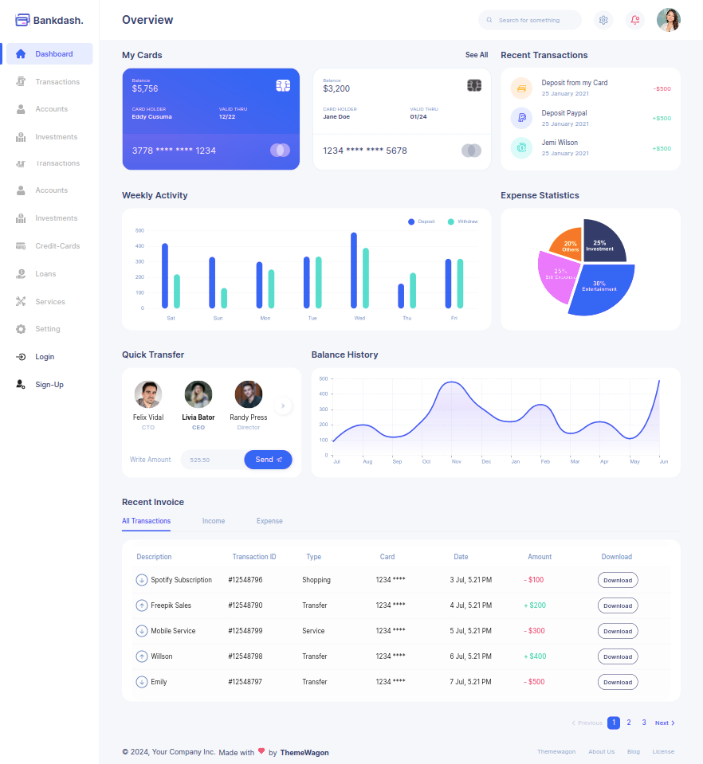

## Bankdash [(Free version)](https://themewagon.github.io/bankdash/)

> Free React Admin Dashboard made with Material-UI components and React.

## Demo

- [Dashboard Page](https://themewagon.github.io/bankdash/)
- [Login Page](https://themewagon.github.io/bankdash/authentication/login)
- [Register Page](https://themewagon.github.io/bankdash/authentication/sign-up)
- [Forgot Password](https://themewagon.github.io/bankdash/authentication/forget-password)
- [Not Found Page](https://themewagon.github.io/bankdash/error/404)

## Quick start

- [Download from Github](https://github.com/themewagon/bankdash/archive/refs/heads/main.zip) or clone the repo : `git clone https://github.com/themewagon/bankdash.git`
- Recommended `Node.js v18.x`.
- **Install:** `npm install`
- **Start:** `npm run dev`
- **Build:** `npm run build`

## License

Distributed under the MIT License. See [LICENSE](https://github.com/minimal-ui-kit/minimal.free/blob/main/LICENSE.md) for more information.

<a name="readme-top">

<a align="center" href="https://github.com/themewagon/Argon-Dashboard-2/graphs/contributors">
 
</a></a>

## Contact us

Email: support@themewagon.com
